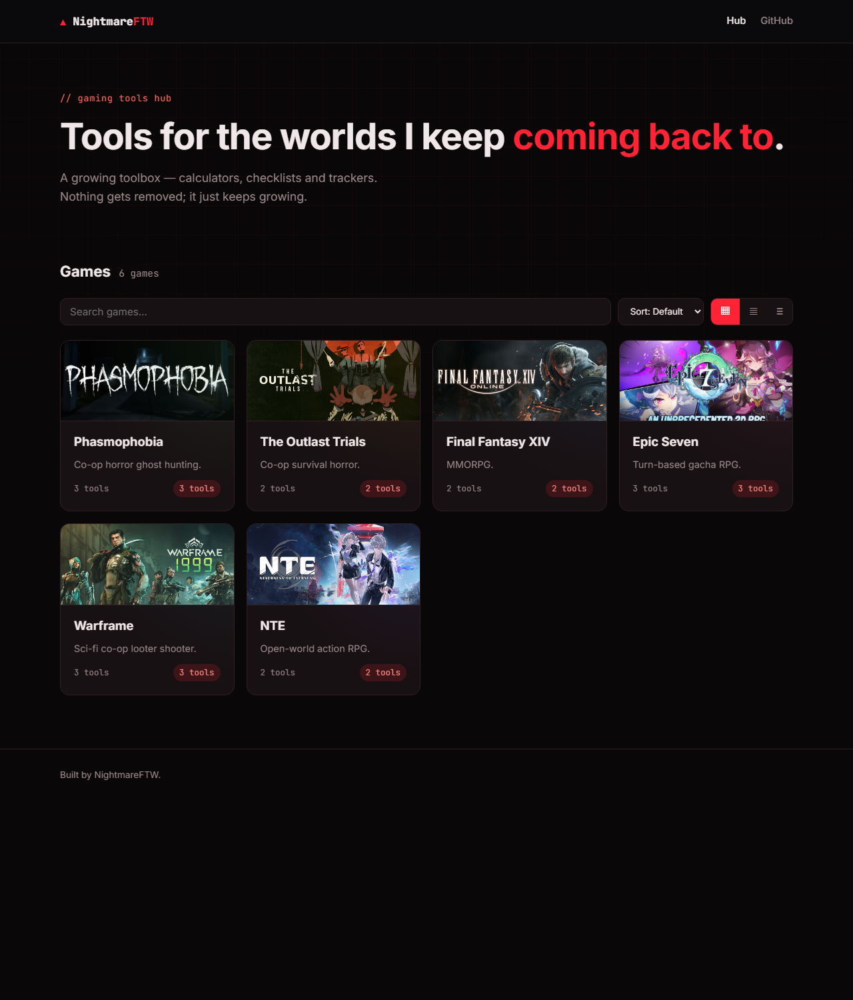
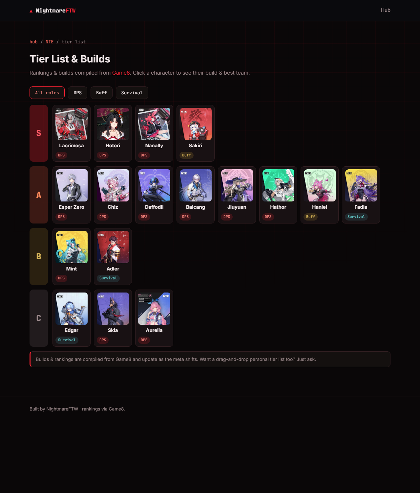
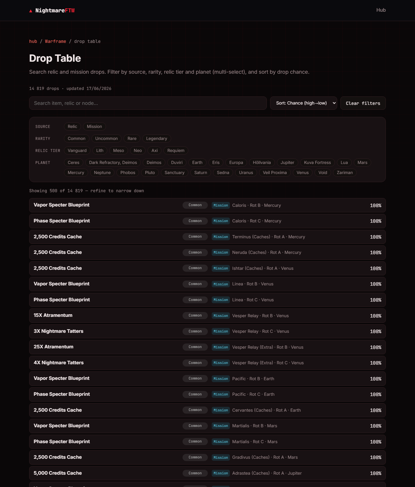
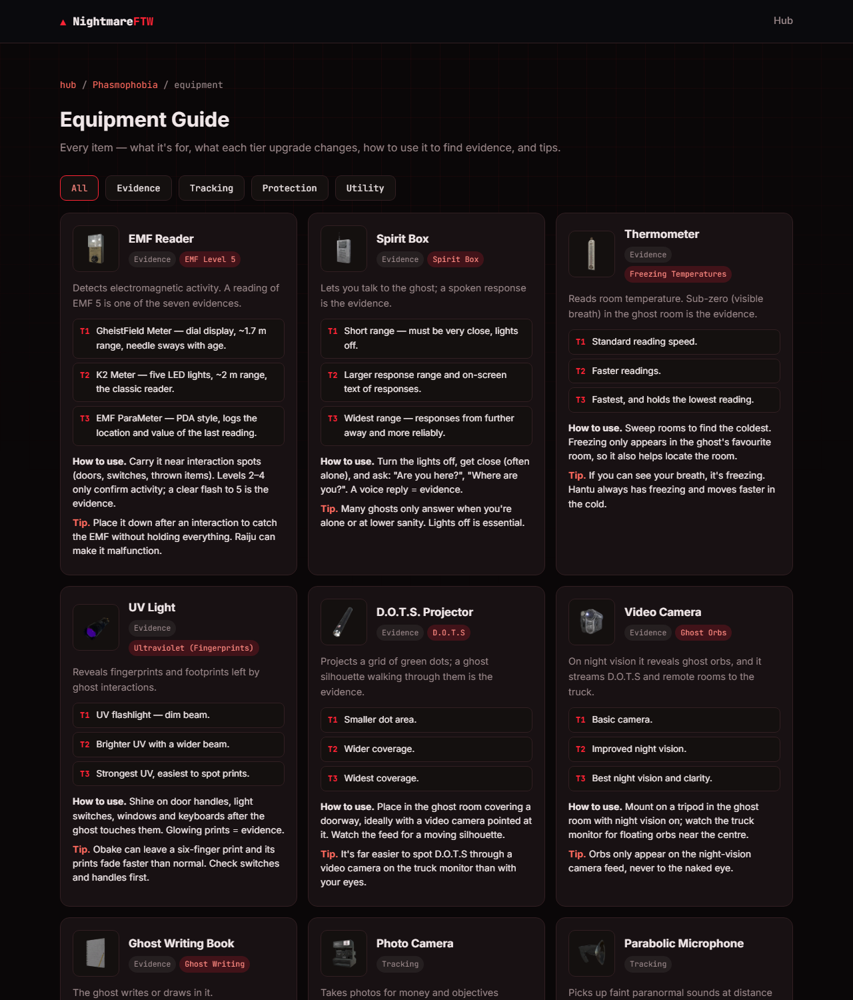

# NightmareFTW · Gaming Tools Hub

A growing hub of hand-built tools for the games I play — checklists, calculators,
trackers, tier lists, drop tables and more. No frameworks, just vanilla
HTML/CSS/JS, hosted on GitHub Pages.

🔗 **Live:** https://nightmareftw.github.io/



---

## What's inside

Each game has its own page with three tabs — **Tools**, **News** (auto-fetched
headlines) and **Codes** (redeemable codes, kept fresh automatically).

| Game | Tools |
| --- | --- |
| **Phasmophobia** | Ghost Evidence Checker · Cursed Possession Reference · Equipment Guide |
| **The Outlast Trials** | Enemies & Counters · Trials & Maps Guide · Recommended Builds · Loadout Builder (shareable builds) |
| **Final Fantasy XIV** | Daily/Weekly Checklist (reset-aware) · Gathering Node Timer (live Eorzea clock) |
| **Epic Seven** | Gear Score · Damage / EHP Calculator · Speed Tuning / Turn Order |
| **Warframe** | Worldstate Tracker · Cycle Timers · Drop Table |
| **Disney Dreamlight Valley** | Star Path Tracker · Recipe Browser · Friendship Tracker · Items Database · Animal Guide |
| **Neverness to Everness** | Daily Checklist · Tier List & Builds · Bond Gift Planner |
| **Cyberpunk 2077** | Meta Builds (in-game-style skill tree & cyberware body diagram) |
| **God of War Ragnarök** | Meta Builds (gear screen with Kratos in each set) · Missables Checklist |
| **Clair Obscur: Expedition 33** | Meta Builds (in-game build screen — Weapon, Pictos, Luminas; meta team) · Missables Checklist |
| **Elden Ring** | Meta Builds (buildtierlist-style, real item icons) · Missables Checklist (NPC questlines) |

A recurring theme in the newer guides: the build tools **recreate the game's own
UI** so a build is impossible to misread — Cyberpunk's perk tree + cyberware body
diagram, God of War's gear screen with Kratos wearing the set, Expedition 33's
build screen, and Elden Ring's equipment grid with real item icons.

The home page supports live search, sorting and grid / list / compact views, plus
**pinning** favourite games to a section up top and **drag-to-reorder** for your
own default order (saved on your device).

### A few in action

**Cyberpunk 2077 / God of War / Expedition 33 / Elden Ring — Meta Builds** — each
recreates that game's build/gear UI: a circuit-style perk tree and 10-slot
cyberware body diagram, a gear screen with Kratos wearing the set, the in-game
Weapon/Pictos/Luminas screen, and a buildtierlist-style equipment grid with real
item icons.

**Neverness to Everness — Tier List & Builds** (rankings & builds compiled from Game8, shown on-site)



**Warframe — Drop Table** (14k+ drops, multi-select filters by source, rarity, relic tier and planet)



**Phasmophobia — Equipment Guide** (every item with images, tier upgrades, usage and tips)



---

## Tech

- **Vanilla** HTML / CSS / JS — no build step, no dependencies, no framework.
- **GitHub Pages** static hosting.
- A single data file ([`assets/js/data.js`](assets/js/data.js)) drives the game grid
  and each game's tool list, so adding content is a one-file change.
- Live data is pulled client-side where an API allows it (Warframe worldstate &
  cycles via [warframestat.us](https://api.warframestat.us); news via Google News RSS).

## Auto-updating data

Some data refreshes itself via scheduled GitHub Actions so the site stays current
without manual edits:

- **News** — [`update-news.yml`](.github/workflows/update-news.yml) runs every 6 hours and
  refreshes `data/news/*.json` from two sources merged newest-first: official **Steam dev
  posts** (full body + image) and **Google News** headlines (resolved to the publisher and
  enriched). Covers every game, including the single-player ones (Cyberpunk, God of War,
  Expedition 33, Elden Ring). Fetched server-side, so the site loads it instantly with no
  CORS proxy.
- **Dreamlight Valley data** — [`update-ddv.yml`](.github/workflows/update-ddv.yml) rebuilds the
  recipes, items, furniture, clothing, animals and Star Path data, with official in-game PT-BR
  names extracted from the game's localization files.
- **Warframe drop table** — [`update-drops.yml`](.github/workflows/update-drops.yml) runs
  weekly and rebuilds `data/warframe/drops.json` from Digital Extremes' official drop
  tables (parsed by [WFCD](https://drops.warframestat.us)).
- **Game codes** are curated in `data/codes/*.json` — auto-scraping them proved too noisy
  to be reliable (no official codes API), so they're kept hand-checked instead.

## Project structure

```
.
├── index.html                # home (game grid + search/sort/views)
├── favicon.svg
├── assets/
│   ├── css/style.css         # all styling (black/red theme)
│   ├── js/
│   │   ├── data.js           # ⭐ central config: games + tools
│   │   ├── home.js           # home grid: search/sort/views + pin & drag-reorder
│   │   ├── game.js           # game page: tabs (Tools/News/Codes) + reset timers
│   │   ├── i18n.js           # optional PT translation layer
│   │   └── checklist.js      # reusable reset-aware checklist engine
│   └── img/games/            # game banners (Steam key art) + generated art
├── games/<game>/             # per-game page + its tool pages (+ build/missables data)
├── data/
│   ├── codes/<game>.json     # redeem codes (curated)
│   ├── news/<game>.json      # headlines (auto-updated)
│   └── <game>/...            # per-game tool data (builds, missables, drops, DDV…)
└── scripts/                  # Node updaters run by the Actions (news, drops, DDV)
```

## Adding a game or tool

Everything is config-driven. To add a tool, append it to the relevant game's
`tools` array in [`assets/js/data.js`](assets/js/data.js):

```js
{
  id: "my-tool",
  name: "My Tool",
  type: "calculator",
  desc: "What it does.",
  href: "games/<game>/my-tool.html",
  available: true,           // false → shows as "soon"
}
```

Then create `games/<game>/my-tool.html`. The home grid and game page update
themselves.

## Credits

Game data and images belong to their respective owners and are used for reference
on this non-commercial personal fan site: Digital Extremes (Warframe, via WFCD),
Smilegate (Epic Seven), Square Enix (FFXIV), Kinetic Games (Phasmophobia),
Red Barrels (The Outlast Trials), Hotta Studio / Perfect World (Neverness to
Everness), Gameloft (Disney Dreamlight Valley), CD Projekt Red (Cyberpunk 2077),
Sony Interactive Entertainment / Santa Monica Studio (God of War Ragnarök),
Sandfall Interactive / Kepler Interactive (Clair Obscur: Expedition 33), and
FromSoftware / Bandai Namco (Elden Ring).

Image sources, all property of their publishers: game banners are official Steam
store key art (Epic Seven's is from the Stove channel); Elden Ring item icons come
from the community [Elden Ring API](https://eldenring.fanapis.com); Expedition 33
character portraits & Picto icons and God of War armour renders come from their
respective Fandom wikis.

Build, favor and collectible data is curated and cross-checked against community
guides — tier lists & builds for Neverness to Everness from
[Game8](https://game8.co/games/Neverness-to-Everness); God of War Ragnarök and
Expedition 33 missables/favors against [PowerPyx](https://www.powerpyx.com/) and
Game8.

---

Built by **NightmareFTW**.
