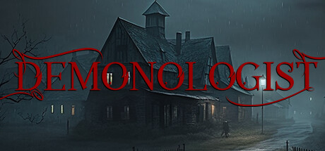

# NightmareFTW · Gaming Tools Hub

A growing hub of hand-built tools for the games I play — checklists, calculators,
trackers, tier lists, drop tables, build guides and more. No frameworks, just
vanilla HTML/CSS/JS, hosted on GitHub Pages.

🔗 **Live:** https://nightmareftw.github.io/


---

## What's inside

Each game has its own page with three tabs — **Tools**, **News** (auto-fetched
headlines) and **Codes** (redeemable codes, kept fresh automatically).

| Game | Tools |
| --- | --- |
| **Phasmophobia** | Ghost Evidence Checker · Cursed Possession Reference · Equipment Guide |
| **The Outlast Trials** | Enemies & Counters · Trials & Maps Guide · Recommended Builds · Loadout Builder (shareable builds) |
| **Final Fantasy XIV** | Daily/Weekly Checklist (reset-aware) · Gathering Node Timer (live Eorzea clock) |
| **Epic Seven** | Gear Score · Damage / EHP Calculator · Speed Tuning / Turn Order |
| **Warframe** | Worldstate Tracker · Cycle Timers · Drop Table |
| **Disney Dreamlight Valley** | Star Path Tracker · Recipe Browser · Friendship Tracker · Items Database · Animal Guide |
| **Neverness to Everness** | Daily Checklist · Tier List & Builds · Bond Gift Planner |
| **Honkai: Star Rail** | Daily/Weekly Checklist · Tier List · Meta Builds (team comps) · Character Builds · Warp Calendar · Event Calendar |
| **Cyberpunk 2077** | Meta Builds (in-game-style skill tree & cyberware body diagram) |
| **God of War Ragnarök** | Meta Builds (gear screen with Kratos in each set) · Missables Checklist |
| **Clair Obscur: Expedition 33** | Meta Builds (in-game build screen — Weapon, Pictos, Luminas; meta team) · Missables Checklist |
| **Elden Ring** | Meta Builds (buildtierlist-style, real item icons) · Missables Checklist (NPC questlines) |
| **Far Far West** | Meta Builds (top-rated community loadouts by weapon, with images) · Maps & Collectibles (interactive region maps with every POI plotted) |
| **Demonologist** | _Coming soon_ — Demon Evidence Checker · Demon Reference · Equipment Guide |

<!-- ➕ New games go here. Each is one object in assets/js/data.js (see "Adding a game or tool"). -->

Two recurring themes in the newer guides:

- **The build tools recreate the game's own UI** so a build is impossible to
  misread — Cyberpunk's perk tree + cyberware body diagram, God of War's gear
  screen with Kratos wearing the set, Expedition 33's build screen, and Elden
  Ring's equipment grid with real item icons.
- **Live, sourced data over hand-typed lists** — tier lists, meta team comps,
  per-character builds and banner/event calendars are scraped from reputable
  community sites (Game8, Prydwen) and refreshed automatically, so they track
  the live patch instead of going stale.

The home page supports live search, sorting and grid / list / compact views, plus
**pinning** favourite games to a section up top and **drag-to-reorder** for your
own default order (saved on your device).

### A few in action

**Honkai: Star Rail — Meta Builds, Warp Calendar & Event Calendar** — the meta
team comps grouped by element, a banner calendar with live/upcoming status, and
an events timeline with a "today" marker — all scraped from Game8 and auto-updated.


**Far Far West — Meta Builds & Maps** — top-rated community loadouts by weapon
(click any for the full kit: weapon stats, joker-rarity layout, spells, hero and
mount, all imported from wikily.gg), and interactive region maps with every
collectible, secret and objective plotted and toggleable by category.


**Cyberpunk 2077 / God of War / Expedition 33 / Elden Ring — Meta Builds** — each
recreates that game's build/gear UI: a circuit-style perk tree and 10-slot
cyberware body diagram, a gear screen with Kratos wearing the set, the in-game
Weapon/Pictos/Luminas screen, and a buildtierlist-style equipment grid with real
item icons.

**Neverness to Everness — Tier List & Builds** (rankings & builds from Game8;
each character's player-tested team comps embedded from Prydwen)


**Warframe — Drop Table** (14k+ drops, multi-select filters by source, rarity, relic tier and planet)


**Phasmophobia — Equipment Guide** (every item with images, tier upgrades, usage and tips)


### Coming soon

Newly added to the hub, tools in progress:

| Game | Planned |
| --- | --- |
|  | **Demonologist** — a Phasmophobia-style set: Demon Evidence Checker, Demon Reference and Equipment Guide. |

---

## Tech

- **Vanilla** HTML / CSS / JS — no build step, no dependencies, no framework.
- **GitHub Pages** static hosting.
- A single data file ([`assets/js/data.js`](assets/js/data.js)) drives the game grid
  and each game's tool list, so adding content is a one-file change.
- Live data is pulled client-side where an API allows it (Warframe worldstate &
  cycles via [warframestat.us](https://api.warframestat.us); news via Google News RSS),
  and from pre-scraped JSON in `data/<game>/` for everything else.

## Auto-updating data

Some data refreshes itself via scheduled GitHub Actions so the site stays current
without manual edits:

- **News** — [`update-news.yml`](.github/workflows/update-news.yml) runs every 6 hours and
  refreshes `data/news/*.json` from official **Steam dev posts** (full body + image) and
  **Google News** headlines (resolved to the publisher), merged newest-first. Fetched
  server-side, so the site loads it instantly with no CORS proxy.
- **Honkai: Star Rail** — five scrapers keep HSR current to the live patch: the
  [tier list](.github/workflows/update-hsr-tierlist.yml), [meta team comps](.github/workflows/update-hsr-teams.yml),
  [per-character builds](.github/workflows/update-hsr-builds.yml) and [warp calendar](.github/workflows/update-hsr-banners.yml)
  (weekly, from Game8), plus the [event calendar](.github/workflows/update-hsr-events.yml) (daily, since events rotate fast).
- **Neverness to Everness** — [`update-nte-teams.yml`](.github/workflows/update-nte-teams.yml)
  pulls each character's player-tested team comps from Prydwen weekly.
- **Far Far West** — [`update-ffw-builds.yml`](.github/workflows/update-ffw-builds.yml) (daily) refreshes the
  top-rated community loadouts, and [`update-ffw-maps.yml`](.github/workflows/update-ffw-maps.yml) (weekly)
  rebuilds every region's collectible/secret map data — both from wikily.gg.
- **Dreamlight Valley data** — [`update-ddv.yml`](.github/workflows/update-ddv.yml) rebuilds the
  recipes, items, furniture, clothing, animals and Star Path data, with official in-game PT-BR
  names from the game's localization files.
- **Warframe drop table** — [`update-drops.yml`](.github/workflows/update-drops.yml) runs
  weekly and rebuilds `data/warframe/drops.json` from Digital Extremes' official drop
  tables (parsed by [WFCD](https://drops.warframestat.us)).
- **Game codes** are curated in `data/codes/*.json` — auto-scraping them proved too noisy
  to be reliable (no official codes API), so they're kept hand-checked instead.

## Project structure

```
.
├── index.html                # home (game grid + search/sort/views)
├── favicon.svg
├── assets/
│   ├── css/style.css         # all styling (black/red theme)
│   ├── js/
│   │   ├── data.js           # ⭐ central config: games + tools
│   │   ├── home.js           # home grid: search/sort/views + pin & drag-reorder
│   │   ├── game.js           # game page: tabs (Tools/News/Codes) + reset timers
│   │   ├── i18n.js           # optional PT translation layer
│   │   └── checklist.js      # reusable reset-aware checklist engine
│   └── img/games/            # game banners (Steam key art) + generated art
├── games/<game>/             # per-game page + its tool pages (+ build/data files)
├── data/
│   ├── codes/<game>.json     # redeem codes (curated)
│   ├── news/<game>.json      # headlines (auto-updated)
│   └── <game>/...            # per-game tool data (builds, tier lists, calendars, drops…)
└── scripts/                  # Node updaters run by the Actions
```

## Adding a game or tool

Everything is config-driven. To add a **game**, append an object to the `GAMES`
array in [`assets/js/data.js`](assets/js/data.js) with a `banner`, `color`, `blurb`
and a `tools` array. To add a **tool**, append it to that game's `tools`:

```js
{
  id: "my-tool",
  name: "My Tool",
  type: "calculator",
  desc: "What it does.",
  href: "games/<game>/my-tool.html",
  available: true,           // false → shows as "soon"
}
```

Then create `games/<game>/my-tool.html`. The home grid and game page update
themselves. Data-driven tools follow a pattern: a `scripts/update-*.js` scraper
writes `data/<game>/*.json`, a `.github/workflows/update-*.yml` runs it on a
schedule, and the tool's JS fetches the JSON with a cache-buster.

## Screenshots

Stored in `assets/screenshots/`. To refresh or add one, capture the tool and save
it under the matching name. Current set (add/replace as the hub grows):

- [x] `home.png` — home grid
- [x] `nte-tierlist.png` — Neverness to Everness tier list
- [x] `warframe-drops.png` — Warframe drop table
- [x] `phasmo-equipment.png` — Phasmophobia equipment guide
- [ ] `hsr-meta-builds.png` — Honkai: Star Rail meta builds
- [ ] `hsr-warp-calendar.png` — Honkai: Star Rail warp calendar
- [ ] `ffw-builds.png` — Far Far West builds (open a build's full detail)
- [ ] `ffw-maps.png` — Far Far West interactive map with markers

## Credits

Game data and images belong to their respective owners and are used for reference
on this non-commercial personal fan site: Digital Extremes (Warframe, via WFCD),
Smilegate (Epic Seven), Square Enix (FFXIV), Kinetic Games (Phasmophobia),
Red Barrels (The Outlast Trials), Hotta Studio / Perfect World (Neverness to
Everness), HoYoverse (Honkai: Star Rail), Gameloft (Disney Dreamlight Valley),
CD Projekt Red (Cyberpunk 2077), Sony Interactive Entertainment / Santa Monica
Studio (God of War Ragnarök), Sandfall Interactive / Kepler Interactive (Clair
Obscur: Expedition 33), FromSoftware / Bandai Namco (Elden Ring), Clock Wizard
Games (Demonologist), and the Far Far West team.

Image sources, all property of their publishers: game banners are official Steam
store key art (Epic Seven's is from the Stove channel); Elden Ring item icons come
from the community [Elden Ring API](https://eldenring.fanapis.com); Expedition 33
character portraits & Picto icons, Cyberpunk 2077 cyberware & weapon icons, and
God of War armour renders come from their respective Fandom wikis.

Build, tier and meta data is sourced from community guides rather than invented:
Honkai: Star Rail tier list, team comps, builds and banner/event calendars from
[Game8](https://game8.co/games/Honkai-Star-Rail); Neverness to Everness tier &
builds from [Game8](https://game8.co/games/Neverness-to-Everness) with player-tested
team comps from [Prydwen](https://www.prydwen.gg/neverness-to-everness/); God of War
Ragnarök and Expedition 33 missables/favors cross-checked against
[PowerPyx](https://www.powerpyx.com/) and Game8.

---

Built by **NightmareFTW**.
